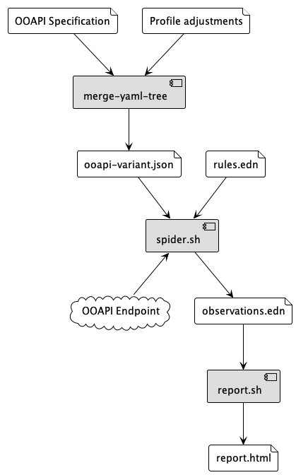

# Eduhub API validator

A collection of command-line tools to spider and validate [Open
Education API](https://openonderwijsapi.nl/) endpoints to ensure
compatibility with services in
[SURFeduhub](https://www.surf.nl/surfeduhub-veilig-uitwisselen-van-onderwijsdata).

These are tools are intended for developers of OOAPI endpoints
at educational institutions or their software suppliers.

# Prerequisites

The tools in this repository require a Clojure runtime. You can
install either [Babashka](https://github.com/babashka/babashka#installation) for a standalone
environment with quick startup time and slightly slower runtime, or
the full [Clojure
installation](https://clojure.org/guides/install_clojure) which
requires Java and is slower to start.

The tools will use Babashka if `bb` is on the PATH, and will use
`clojure` otherwise.

# For endpoint developers

This repository contains the tools and configuration to validate a
"complete" OpenAPI endpoint with all of the paths available in the
specification.

Endpoints are not required to implement every path in the
specification. We are working on profiles (variant/subset OpenAPI
specifications) for different use-cases, like the RIO mapper
interface, which will be added to this repository.

Validating an endpoint works in two steps:

  - Spidering the endpoint and validating the responses. This will
    create a large file with "observations"; a sequence of
    request/response pairs and the associated validation issues.
    
  - Aggregating the observations into a readable HTML report.
  
## Spidering an endpoint

```sh
./spider.sh -r rules.edn -o openapi.json \
  -u https://your-endpoint/ \
  -p observations.edn
```

This will exhaustively index your endpoint paths and print the
resulting observations to `observations.edn`. This file is in [EDN
format](https://github.com/edn-format/edn) which is similar to JSON
and can be read as text, but it will probably be very large.

## Spidering via gateway

_Work in progress_

To run the spider through the Eduhub gateway, you can use the
`--basic-auth` and `--headers` options:

```sh
./spider.sh \
  -o openapi.json \
  -r rules.edn \
  -u https://gateway.test.surfeduhub.nl/ \
  --basic-auth USERNAME:PASS \
  -h 'x-route: endpoint=demo04.test.surfeduhub.nl' \
  -h 'accept: application/json; version=5' \
  -h 'x-envelope-response: false' \
  -p observations.edn
```

Currently the test gateway does not correctly process the
`x-envelope-response` header so the above will result in a lot of
validation issues related to the response envelope.

## Creating a report

After spidering is completed, you can create a readable report using

```sh
./report.sh -o openapi.json -p report.html observations.edn
```

This report is readable in any web browser.

## On windows

Use `spider.bat` and `report.bat` instead of the `.sh` scripts.

# For specification editors

## Profiles

Profiles are variants of an OpenAPI definition. We create profiles of
the OpenOnderwijsAPI spec for different use cases.

Profiles are created using
[merge-yaml-tree](https://git.sr.ht/~jomco/merge-yaml-tree). We will
include a collection of pre-made profiles in this repository in the
near future.

# Component overview



